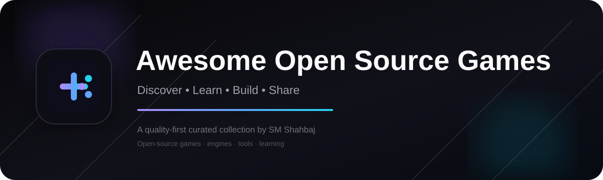

<div align="center">



<br>

[](https://awesome.re)
[](CHANGELOG.md)
[](LICENSE)
[](CONTRIBUTING.md)
[](SECURITY.md)

**A curated, continuously maintained directory of open-source games, game reimplementations, engines, frameworks, tools, and learning resources.**

[Explore games](#-open-source-games) · [Classic reimplementations](#️-classic-reimplementations--source-ports) · [Engines](#-game-engines--frameworks) · [Changelog](CHANGELOG.md) · [Contribute](CONTRIBUTING.md)

</div>

---

## ✨ What is this?

**Awesome Open Source Games** is a curated index for people who want to **play, study, modify, or build** games with openly available source code.

The project deliberately separates **fully open-source games**, **reimplementations/source ports**, and **development engines/tools**. A source repository being public does **not** automatically mean that its assets, data, trademarks, or original commercial game are open source.

> 🎯 **Play it. Read it. Learn from it. Build something better.**

This repository is an **index, not a mirror**. The projects listed here remain the property of their respective authors and communities.

---

## 📊 Collection at a glance

| Area | Approx. entries |
| --- | ---: |
| 🎮 Open-source games | 275 unique |
| 🕹️ Classic reimplementations / source ports | 49 unique |
| 🧩 Engines & frameworks | 22 unique |
| 🛠️ Tools & libraries | 15 unique |
| 📚 Learning resources | 10+ |
| 🌍 Platforms | Windows · Linux · macOS · Android · Web · BSD · consoles* |

\* Platform availability varies by project. A source repository may be buildable on additional platforms even when official binaries are not provided.

---

## 🧭 Contents

- [🎮 Open-source games](#-open-source-games)
  - [Strategy & 4X](#strategy--4x)
  - [City-building & management](#city-building--management)
  - [RPG & roguelike](#rpg--roguelike)
  - [Action, shooter & arena](#action-shooter--arena)
  - [Adventure & story](#adventure--story)
  - [Platformer & arcade](#platformer--arcade)
  - [Racing & sports](#racing--sports)
  - [Sandbox & survival](#sandbox--survival)
  - [Puzzle, board & card](#puzzle-board--card)
  - [MMO & multiplayer](#mmo--multiplayer)
  - [Simulation & experimental](#simulation--experimental)
  - [Rhythm & music](#rhythm--music)
- [🕹️ Classic reimplementations & source ports](#️-classic-reimplementations--source-ports)
- [🧩 Game engines & frameworks](#-game-engines--frameworks)
- [🛠️ Game-development tools & libraries](#️-game-development-tools--libraries)
- [📚 Learning resources](#-learning-resources)
- [🔎 Selection & verification policy](#-selection--verification-policy)
- [🤝 Contributing](#-contributing)
- [⚖️ Licensing & attribution](#️-licensing--attribution)
- [📋 Changelog](CHANGELOG.md)
- [🗺️ Roadmap](#️-roadmap)

---

# 🎮 Open-source games

These entries are intended to be playable games or game projects whose source code is openly available. Where a project is primarily a reimplementation, it belongs in the dedicated section below instead.

## Strategy & 4X

- **[0 A.D.](https://github.com/0ad/0ad)** — Free, open-source historical real-time strategy game.
- **[Beyond All Reason](https://github.com/beyond-all-reason/Beyond-All-Reason)** — Large-scale open-source RTS descended from the Spring ecosystem.
- **[The Battle for Wesnoth](https://github.com/wesnoth/wesnoth)** — Turn-based fantasy strategy game with campaigns and multiplayer.
- **[Freeciv](https://github.com/freeciv/freeciv)** — Open-source empire-building strategy game inspired by Civilization.
- **[FreeOrion](https://github.com/freeorion/freeorion)** — Turn-based 4X space strategy game.
- **[OpenHV](https://github.com/OpenHV/OpenHV)** — Open-source pixel-art science-fiction RTS built with OpenRA technology.
- **[Warzone 2100](https://github.com/Warzone2100/warzone2100)** — 3D real-time strategy with campaign, skirmish and multiplayer.
- **[Widelands](https://github.com/widelands/widelands)** — Open-source real-time strategy and settlement-building game.
- **[Zero-K](https://github.com/ZeroK-RTS/Zero-K)** — Open-source RTS with physics-based projectiles and deep automation.
- **[Hedgewars](https://github.com/hedgewars/hw)** — Turn-based artillery strategy game with a humorous presentation.
- **[Tanks of Freedom](https://github.com/w84death/Tanks-of-Freedom)** — Isometric turn-based strategy game.
- **[TripleA](https://github.com/triplea-game/triplea)** — Grand-strategy and board-game engine inspired by Axis & Allies.
- **[Unciv](https://github.com/yairm210/Unciv)** — Open-source 4X strategy game inspired by Civilization V.
- **[Colobot](https://github.com/colobot/colobot)** — Real-time strategy game where programming is part of the gameplay.
- **[MegaGlest](https://github.com/megaglest/megaglest-source)** — Cross-platform 3D real-time strategy game.
- **[Pax Britannica](https://github.com/krisives/pax-britannica)** — Minimalist underwater one-button RTS.
- **[OpenFrontIO](https://github.com/openfrontio/OpenFrontIO)** — Browser-based online real-time strategy project.
- **[Athena Crisis](https://github.com/nkzw-tech/athena-crisis)** — Modern-retro turn-based tactical strategy game.
- **[Open General](https://github.com/owain94/OpenGeneral)** — Open-source strategy engine inspired by Panzer General-style gameplay.
- **[Wyrmsun](https://github.com/Andrettin/Wyrmsun)** — Strategy game combining history, mythology and fantasy.
- **[Stone Kingdoms](https://gitlab.com/stone-kingdoms/stone-kingdoms)** — Real-time strategy game inspired by classic Stronghold-style design.
- **[KaM Remake](https://github.com/Kromster80/kam_remake)** — Open-source remake of Knights and Merchants.

## City-building & management

- **[Unknown Horizons](https://github.com/unknown-horizons/unknown-horizons)** — 2D economic RTS focused on settlement and city building.
- **[Cytopia](https://github.com/CytopiaTeam/Cytopia)** — Retro pixel-art city-building game.
- **[Citybound](https://github.com/citybound/citybound)** — Experimental city simulator based on emergent systems.
- **[Micropolis](https://github.com/SimHacker/micropolis)** — Open-source city-building game based on the original SimCity codebase.
- **[Caesaria](https://github.com/dalerank/caesaria-game)** — Open-source Caesar III-inspired city-building project.
- **[Egregoria](https://github.com/Uriopass/Egregoria)** — Indie city builder inspired by modern city simulators.
- **[Freeserf.net](https://github.com/Siedler2/Freeserf.net)** — Open-source reimplementation of The Settlers I.

## RPG & roguelike

- **[Cataclysm: Dark Days Ahead](https://github.com/CleverRaven/Cataclysm-DDA)** — Deep post-apocalyptic survival roguelike.
- **[Dungeon Crawl Stone Soup](https://github.com/crawl/crawl)** — Classic open-source dungeon roguelike.
- **[Brogue CE](https://github.com/tmewett/BrogueCE)** — Minimalist turn-based procedural roguelike.
- **[NetHack](https://github.com/NetHack/NetHack)** — Long-running dungeon exploration roguelike.
- **[Angband](https://github.com/angband/angband)** — Tolkien-inspired dungeon exploration roguelike.
- **[KeeperRL](https://github.com/miki151/keeperrl)** — Roguelike dungeon-builder inspired by Dwarf Fortress.
- **[Shattered Pixel Dungeon](https://github.com/00-Evan/shattered-pixel-dungeon)** — Open-source traditional roguelike for desktop and mobile.
- **[OpenNefia](https://github.com/Elin-Modding/OpenNefia)** — Moddable open-source engine/reimplementation inspired by Elona.
- **[Flare](https://github.com/clintbellanger/flare-engine)** — Free/libre action-RPG engine and game ecosystem.
- **[Valyria Tear](https://github.com/Bertram25/ValyriaTear)** — Open-source 2D J-RPG.
- **[Monster RPG 2](https://github.com/Nooskewl/monster-rpg-2)** — Turn-based J-RPG with an original setting.
- **[Crystal Picnic](https://github.com/Nooskewl/crystal-picnic)** — Colourful action-RPG project.
- **[Egoboo](https://github.com/egoboo/egoboo)** — 3D dungeon-crawling RPG inspired by NetHack.
- **[Dungeon Monkey Eternal](https://github.com/jwvhewitt/dmeternal)** — Party-based fantasy roguelike RPG.
- **[Endless Sky](https://github.com/endless-sky/endless-sky)** — Space exploration, trading and combat RPG.
- **[Veloren](https://gitlab.com/veloren/veloren)** — Multiplayer voxel action-RPG written in Rust.
- **[Stendhal](https://github.com/arianne/stendhal)** — Free 2D multiplayer online RPG.
- **[Terasology](https://github.com/MovingBlocks/Terasology)** — Extensible voxel game platform with RPG/sandbox possibilities.
- **[Meridian 59](https://github.com/Meridian59/Meridian59)** — Community-developed open-source MMORPG.

## Action, shooter & arena

- **[Xonotic](https://gitlab.com/xonotic/xonotic)** — Fast-paced open-source arena FPS.
- **[Unvanquished](https://github.com/Unvanquished/Unvanquished)** — Open-source FPS/RTS hybrid powered by the Daemon engine.
- **[AssaultCube](https://github.com/assaultcube/AC)** — Lightweight multiplayer FPS.
- **[Red Eclipse](https://github.com/redeclipse/base)** — Fast arena shooter based on Cube technology.
- **[Liblast](https://codeberg.org/liblast/liblast)** — Libre multiplayer FPS built with Godot 4.
- **[The Dark Mod](https://github.com/darkmod/thedarkmod)** — Open-source stealth FPS with a large mission ecosystem.
- **[Anarch](https://gitlab.com/drummyfish/anarch)** — Compact retro FPS with a deliberately minimal footprint.
- **[Taisei Project](https://github.com/taisei-project/taisei)** — Open-source bullet-hell shoot-'em-up inspired by Touhou.
- **[Teeworlds](https://github.com/teeworlds/teeworlds)** — Online multiplayer 2D shooter/platform game.
- **[Warsow](https://github.com/Warsow/qfusion)** — Fast-paced FPS set in a futuristic cartoonish world.
- **[Darkest Hour](https://github.com/DarklightGames/DarkestHour)** — World War 2 online multiplayer tactical shooter based on Red Orchestra: Ostfront.
- **[DynaDungeons](https://github.com/akien-mga/dynadungeons)** — Bomberman clone built with the open source Godot game engine.
- **[Chaos Projectile](https://github.com/WinterLicht/Chaos-Projectile)** — 2D run'n'gun action game with RPG elements.
- **[OpenLieroX](https://github.com/allegator/olx)** — Real-time 2D artillery/action game inspired by Liero.
- **[Space Station 14](https://github.com/space-wizards/space-station-14)** — Open-source multiplayer role-playing/simulation game inspired by Space Station 13.
- **[Witch Blast](https://github.com/witchblast/witchblast)** — Open-source roguelite dungeon shooter.
- **[Hypersomnia](https://github.com/TeamHypersomnia/Hypersomnia)** — Competitive top-down multiplayer shooter.
- **[Doomsday Engine](https://github.com/skyjake/Doomsday-Engine)** — Modern engine/source-port ecosystem for classic id games.

## Adventure & story

- **[Frogatto & Friends](https://github.com/frogatto/frogatto)** — Action-adventure platformer starring a frog hero.
- **[Solarus](https://github.com/solarus-games/solarus)** — Open-source action-RPG engine designed for Zelda-like games.
- **[Pioneer](https://github.com/pioneerspacesim/pioneer)** — Space adventure and trading simulation.
- **[Minilens](https://github.com/KOBUGE-Games/minilens)** — Puzzle-platformer starring a cleaning robot.
- **[AAAAXY](https://github.com/divverent/aaaaxy)** — Nonlinear 2D puzzle-platformer set in impossible spaces.

## Platformer & arcade

- **[Sonic Robo Blast 2](https://git.do.srb2.org/STJr/SRB2)** — Open-source 3D Sonic fangame built on Doom technology.
- **[DDraceNetwork](https://github.com/ddnet/ddnet)** — Cooperative online 2D platform game.
- **[VVVVVV](https://github.com/TerryCavanagh/VVVVVV)** — Open-source release of the platform game VVVVVV.
- **[Polly-B-Gone](https://github.com/aeonsoft/Polly-B-Gone)** — Physics-based platform game about a wheeled robot.
- **[Chromacore](https://github.com/Murkantilism/game-off-2013)** — Game Off-era 2D musical platformer.
- **[Nodulus](https://github.com/Hyperparticle/nodulus)** — Mathematical puzzle game built around rotating cube-and-rod structures.

## Racing & sports

- **[SuperTuxKart](https://github.com/supertuxkart/stk-code)** — Full-featured open-source kart racing game.
- **[Stunt Rally](https://github.com/stuntrally/stuntrally3)** — 3D rally racing game with track editor.
- **[Speed Dreams](https://forge.a-lec.org/xavi/speed-dreams-code)** — Open-source motorsport simulator.
- **[Rigs of Rods](https://github.com/RigsOfRods/rigs-of-rods)** — Vehicle physics and simulation sandbox.
- **[TORCS](https://sourceforge.net/projects/torcs/)** — Open-source racing simulator.
- **[Dust Racing 2D](https://github.com/juzzlin/DustRacing2D)** — Top-down racing game with level editor.
- **[Extreme Tux Racer](https://github.com/extremetuxracer/extremetuxracer)** — Physics-driven downhill racing game.
- **[Pikifen](https://github.com/Espyo/Pikifen)** — Open-source Pikmin-inspired engine/game project.
- **[Pooltool](https://github.com/ekiefl/pooltool)** — Billiards simulation and physics project.
- **[YSFlight Community Edition](https://github.com/YSFlight/YSFlightCommunityEdition)** — Community-developed flight simulator branch.

## Sandbox & survival

- **[Luanti](https://github.com/luanti-org/luanti)** — Open voxel game platform formerly known as Minetest.
- **[Mindustry](https://github.com/Anuken/Mindustry)** — Sandbox factory-building and tower-defense game.
- **[The Powder Toy](https://github.com/The-Powder-Toy/The-Powder-Toy)** — Falling-sand physics sandbox.
- **[Blackvoxel](https://github.com/Blackvoxel/Blackvoxel)** — Voxel sandbox focused on simulation and experimentation.
- **[Freeminer](https://github.com/freeminer/freeminer)** — Minecraft-inspired voxel sandbox.
- **[Craft](https://github.com/fogleman/Craft)** — Small Minecraft-inspired C/OpenGL game.
- **[Manic Digger](https://github.com/manicdigger/manicdigger)** — Multiplayer block-building voxel game.
- **[Thrive](https://github.com/Revolutionary-Games/Thrive)** — Open-source evolution and life simulation game.
- **[EmptyEpsilon](https://github.com/daid/EmptyEpsilon)** — Multiplayer bridge simulator inspired by science-fiction starship crews.
- **[Cataclysm: Bright Nights](https://github.com/cataclysmbnteam/Cataclysm-BN)** — Community fork of Cataclysm: DDA.

## Puzzle, board & card

- **[Enigma](https://github.com/Enigma-Game/Enigma)** — Puzzle game inspired by Oxyd.
- **[Wizznic](https://github.com/DusteDdk/Wizznic)** — Open-source tile/puzzle game.
- **[Nudoku](https://github.com/jubalh/nudoku)** — Terminal-based Sudoku game.
- **[PokerTH](https://github.com/pokerth/pokerth)** — Texas Hold'em game with online multiplayer and bots.
- **[Whatajong](https://github.com/masylum/whatajong)** — Mahjong game.
- **[Hnefatafl](https://github.com/dcampbell24/hnefatafl)** — Open-source implementation of the historical board game.
- **[C4](https://github.com/kenrick95/c4)** — Connect Four with AI in HTML/CSS/JS.
- **[FreeCol](https://github.com/FreeCol/freecol)** — Turn-based strategy game inspired by Colonization.
- **[OpenPanzer](https://github.com/OpenPanzer/openpanzer)** — Browser-based Panzer General-style strategy game.

## MMO & multiplayer

- **[Open-KO](https://github.com/Temuking/OpenKO)** — Knight Online reimplementation project.

## Simulation & experimental

## Rhythm & music

- **[osu!](https://github.com/ppy/osu)** — Open-source rhythm game with a large community ecosystem.
- **[StepMania](https://github.com/stepmania/stepmania)** — Cross-platform rhythm and dance game engine.

---

## Additional researched games

Additional verified open-source game projects. Projects that are primarily engines, libraries, or asset-dependent reimplementations belong in their dedicated sections instead.

### Strategy, tactics & 4X

- **[FreeMars](https://github.com/FreeMars/FreeMars)** — Turn-based strategy game inspired by the classic Mars strategy genre.
- **[WarMUX](https://github.com/warmux/warmux)** — Turn-based artillery game with network multiplayer.
- **[War1gus](https://github.com/war1gus/war1gus)** — Warcraft: Orcs & Humans implementation built on Stratagus.
- **[OpenKrush](https://github.com/OpenKrush/OpenKrush)** — OpenRA-based reimplementation of KKnD and KKnD2.
- **[OpenE2140](https://github.com/OpenE2140/OpenE2140)** — OpenRA-based Earth 2140 reimplementation.
- **[OpenSA](https://github.com/OpenRA-Mods/OpenSA)** — OpenRA-based Swarm Assault reimplementation.
- **[Shattered Paradise](https://github.com/OpenRA/ra2)** — OpenRA-based Tiberian Sun-inspired community project.
- **[MegaMek](https://github.com/MegaMek/megamek)** — Networked implementation of the BattleTech tabletop game.
- **[MekHQ](https://github.com/MegaMek/mekhq)** — Campaign management companion for MegaMek.
- **[Spring: 1944](https://github.com/rennex/spring1944)** — World War II RTS built for the Spring ecosystem.
- **[Kernel Panic](https://github.com/ZeroK-RTS/Kernel-Panic)** — Fast-paced abstract RTS total conversion for the Spring engine.
- **[Evolution RTS](https://github.com/EvolutionRTS/Evolution-RTS)** — Open-source RTS built on the Spring engine.
- **[Globulation 2](https://github.com/Globulation2/glob2)** — Innovative real-time strategy game with automated unit management.
- **[OpenDungeons](https://github.com/OpenDungeons/OpenDungeons)** — Dungeon-management strategy game inspired by Dungeon Keeper.
- **[Seven Kingdoms: Ancient Adversaries](https://github.com/kallisti5/7kaa)** — Classic RTS released under an open-source license.
- **[Ancient Beast](https://github.com/FreezingMoon/AncientBeast)** — Turn-based tactical strategy game with controllable creatures.
- **[Curse of War](https://github.com/a-nikolaev/curseofwar)** — Fast-paced action strategy game with ncurses and SDL frontends.
- **[Race into Space](https://github.com/raceintospace/raceintospace)** — Turn-based space race strategy game originally by Interplay, open-sourced and community maintained.

### RPG, roguelike & survival

- **[Pixel Dungeon](https://github.com/watabou/pixel-dungeon)** — Classic open-source Android roguelike.
- **[Yet Another Pixel Dungeon](https://github.com/OnlyLeigh/YetAnotherPixelDungeon)** — Community Pixel Dungeon variant.
- **[Ananias](https://github.com/ananiasgame/ananias)** — Browser and mobile-friendly roguelike dungeon game.
- **[Sil-Q](https://github.com/sil-quirk/sil-q)** — Tolkien-inspired tactical roguelike derived from Angband.
- **[Naev](https://github.com/naev/naev)** — 2D space exploration and combat RPG.
- **[Arx Libertatis](https://github.com/arx/ArxLibertatis)** — Modern Arx Fatalis engine/port; original data is required.
- **[Cendric](https://github.com/tizian/Cendric2)** — Platformer-RPG in a fantasy setting with puzzle elements.
- **[Legend of Elya](https://github.com/Scottcjn/legend-of-elya-n64)** — Zelda-style dungeon crawler for Nintendo 64 featuring a tiny neural-network NPC system running live inference on original hardware.

### FPS, action & arcade

- **[OpenArena](https://github.com/OpenArena/engine)** — Free/open-source arena FPS based on idTech3 technology.
- **[Tremulous](https://github.com/darklegion/tremulous)** — Asymmetric alien-versus-human FPS/RTS game.
- **[Smokin' Guns](https://github.com/smokinguns/smokinguns)** — Western-themed FPS built on idTech technology.
- **[OpenSpades](https://github.com/yvt/openspades)** — Open-source Ace of Spades-compatible client.
- **[Warfork](https://github.com/TeamForbidden/Warfork)** — Fast arena FPS descended from the Warsow ecosystem.
- **[Turtle Arena](https://github.com/tycho/turtle-arena)** — Open-source third-person action game using Spearmint technology.
- **[C-Dogs SDL](https://github.com/cxong/cdogs-sdl)** — Cooperative overhead run-and-gun action game.
- **[SuperTux](https://github.com/SuperTux/supertux)** — Classic open-source platformer.
- **[Secret Maryo Chronicles](https://github.com/Secretchronicles/SMC)** — Open-source 2D platformer.
- **[The Legend of Edgar](https://github.com/stransky/edgar)** — 2D action-platformer with exploration and combat.
- **[Pingus](https://github.com/Pingus/pingus)** — Lemmings-inspired puzzle/strategy game.
- **[Neverball](https://github.com/Neverball/neverball)** — 3D puzzle/arcade game focused on rolling a ball.
- **[Frozen Bubble](https://github.com/kthakore/frozen-bubble)** — Colorful puzzle/arcade game with multiplayer.
- **[OpenTyrian](https://github.com/opentyrian/opentyrian)** — Open-source port of the classic Tyrian shoot-'em-up.
- **[Freedoom](https://github.com/freedoom/freedoom)** — Free software project providing a complete Doom-compatible game dataset.
- **[Gish](https://github.com/blinry/gish)** — Physics-based platformer with released source code.
- **[ReTux](https://github.com/Retux/Retux)** — Open-source platformer inspired by SuperTux.
- **[Super Bombinhas](https://github.com/victords/super-bombinhas)** — Retro platformer with hand-crafted pixel art levels.
- **[Double Damnation](https://github.com/TheYellowArchitect/doubledamnation)** — Exclusively co-op Metroidvania with movement inspired by Super Smash Bros. Melee.

### Racing, sports & vehicles

- **[Stunt Rally](https://github.com/stuntrally/stuntrally)** — 3D rally game with a track editor.
- **[Speed Dreams](https://github.com/jimmyorourke/speed-dreams)** — Open-source motorsport simulator.
- **[VDrift](https://github.com/VDrift/vdrift)** — Open-source driving simulation.
- **[VGA Golf](https://github.com/DraknekGames/VGAGolf)** — Retro-style golf project.
- **[Performous](https://github.com/performous/performous)** — Open-source rhythm and singing game.
- **[Frets on Fire X](https://github.com/fofix/fofix)** — Community rhythm-game fork with guitar-style gameplay.

### Sandbox, simulation & world-building

- **[VoxeLibre](https://github.com/VoxeLibre/VoxeLibre)** — Minecraft-like voxel game for Luanti.
- **[MineClone2](https://git.minetest.land/MineClone2/MineClone2)** — Minecraft-inspired voxel game for Luanti.
- **[OpenClonk](https://github.com/openclonk/openclonk)** — 2D multiplayer sandbox game with construction and exploration.
- **[Freeserf](https://github.com/Siedler2/OpenSiedler)** — Open reimplementation of The Settlers.

### Browser, board, card & casual games

- **[Lichess](https://github.com/lichess-org/lila)** — Full open-source online chess platform.
- **[Chessmata](https://github.com/jonradoff/chessmata)** — Multiplayer chess platform with real-time WebSocket gameplay, Elo-based matchmaking, 3D browser board, and UCI-compatible CLI.
- **[Wolfcha](https://github.com/oil-oil/wolfcha)** — Werewolf (Mafia) social deduction game where every player is controlled by a language model bot, built with Next.js and TypeScript.
- **[FreeChess](https://github.com/freechessclub/freechess)** — Open-source online chess software.
- **[2048](https://github.com/gabrielecirulli/2048)** — Popular open-source sliding-number puzzle.
- **[A Dark Room](https://github.com/bitbrain/adr)** — Minimalist browser-based incremental adventure game.
- **[Hextris](https://github.com/Hextris/hextris)** — Fast-paced hexagonal tile puzzle.
- **[Untrusted](https://github.com/AlexNisnevich/untrusted)** — Meta-JavaScript adventure/puzzle game.
- **[Sandboxels](https://github.com/ProllM/Sandboxels)** — Browser-based falling-sand simulation.
- **[BrowserQuest](https://github.com/mozilla/BrowserQuest)** — HTML5 multiplayer RPG experiment.
- **[Reia](https://github.com/Quaint-Studios/Reia)** — Action-adventure MMO RPG focused on story, combat, and open-world sandbox adventure, built with Godot, Rust, and Zig.
- **[Backdooms](https://github.com/Kuberwastaken/backdooms)** — Browser FPS inspired by DOOM 1993 and The Backrooms, small enough to be self-contained inside a QR code.
- **[Freeciv-web](https://github.com/freeciv/freeciv-web)** — Browser-based Civilization-style strategy game.
- **[HexGL](https://github.com/BKcore/HexGL)** — WebGL futuristic racing game.
- **[Trigger Rally](https://github.com/CodeArtemis/TriggerRally)** — Browser-based arcade rally game.

### Educational, programming & experimental games

- **[Robocode](https://github.com/robo-code/robocode)** — Programming game centered on robot battles.
- **[WarriorJS](https://github.com/olistic/warriorjs)** — Programming game where code controls a warrior.
- **[Screeps](https://github.com/screeps/screeps)** — MMO programming game where JavaScript controls persistent colonies.
- **[TIS-100](https://github.com/ian-albert/tis-100)** — Community implementations inspired by assembly-programming puzzle games.
- **[0hh1](https://github.com/Q42/0hh1)** — Logic puzzle game.
- **[Game of Life](https://github.com/topics/conway-game-of-life)** — Large collection of open implementations and interactive variants.

## Additional open-source game projects

### Strategy & simulation

- **[OpenBW](https://github.com/bwapi/bwapi)** — Community tooling around StarCraft compatibility and bot development.
- **[Bos Wars](https://github.com/boswars/boswars)** — Futuristic real-time strategy game.
- **[OpenPanzer](https://github.com/akarnokd/openpanzer)** — Browser-based tactical strategy game.

### Roguelikes & RPGs

- **[Brogue](https://github.com/jeremysalwen/Brogue)** — Classic Brogue source tree.
- **[Sil](https://github.com/sil-quirk/sil)** — Silmarillion-inspired roguelike.

### FPS & action

### Sandbox, simulation & vehicles

### Rhythm, board & casual

- **[A Dark Room](https://github.com/doublespeakgames/adarkroom)** — Minimalist browser adventure/incremental game.

### Programming & experimental

## Preservation & historical open-source games

These entries are included for preservation, study, or historical value. **Inactive** does not mean unusable; it means development is no longer a primary reason for inclusion.

- **[1oom](https://github.com/1oom-fork/1oom)** — Open-source engine for the classic Master of Orion-style 4X experience.
- **[2004scape](https://github.com/2004scape/2004scape)** — Open-source recreation of the 2004 RuneScape era.
- **[2006Scape](https://github.com/2006-Scape/Server)** — Open-source RuneScape-era server project.
- **[2009scape](https://gitlab.com/2009scape/2009scape)** — Open-source RuneScape-era server/client ecosystem.
- **[BZFlag](https://github.com/BZFlag-Dev/bzflag)** — Multiplayer 3D tank battle game.
- **[BurgerSpace](https://github.com/vitaly-t/burgerspace)** — Arcade game inspired by BurgerTime.
- **[Bygfoot](https://github.com/bygfoot/bygfoot)** — Football management simulation.
- **[C-evo](https://github.com/c-evo/c-evo)** — Turn-based empire-building strategy game.
- **[Cabbages and Kings](https://github.com/cabbagesandkings/cabbagesandkings)** — Small open-source strategy/game project.
- **[Cadaver](https://github.com/davidgiven/cadaver)** — Open-source adventure game recreation.
- **[Cannon Smash](https://github.com/zephyrus/cannonsmash)** — Table-tennis game.
- **[Cannonball](https://github.com/djyt/cannonball)** — Open-source OutRun engine recreation.
- **[Captain Blood](https://github.com/danielest/CaptainBlood)** — Open-source classic sci-fi game project.
- **[Cart Life](https://github.com/cartlife/cartlife)** — Open-source indie simulation/adventure game.
- **[Castle of the Winds](https://github.com/ljw1004/cotw)** — Open-source revival of the classic Windows RPG.
- **[Candy Box 2](https://github.com/candybox2/candybox2.github.io)** — Browser-based ASCII incremental adventure.
- **[Dune Legacy](https://github.com/dunelegacy/dunelegacy)** — Open-source Dune II-inspired RTS.
- **[Dune Dynasty](https://github.com/gameflorist/dune-dynasty)** — Dune II engine/reimplementation project.
- **[DXX-Rebirth](https://github.com/dxx-rebirth/dxx-rebirth)** — Source port of Descent and Descent II.
- **[EasyRPG Player](https://github.com/EasyRPG/Player)** — Open-source RPG Maker 2000/2003-compatible player.
- **[Eat The Whistle](https://github.com/ptitSeb/EatTheWhistle)** — Open football/soccer game.
- **[ECWolf](https://github.com/ecwolf/ECWolf)** — Wolfenstein 3D engine/source port.
- **[EDGE](https://github.com/edge-classic/EDGE-classic)** — Doom-family source port.
- **[ET: Legacy](https://github.com/etlegacy/etlegacy)** — Open-source Wolfenstein: Enemy Territory engine/game client.
- **[Etterna](https://github.com/etternagame/etterna)** — Open-source rhythm game.
- **[Falltergeist](https://github.com/falltergeist/falltergeist)** — Fallout 2 engine recreation.
- **[Fallout Community Edition](https://github.com/alexbatalov/fallout1-ce)** — Modern Fallout engine recreation.
- **[Fallout 2 Community Edition](https://github.com/alexbatalov/fallout2-ce)** — Modern Fallout 2 engine recreation.
- **[Fanwor](https://github.com/ekoeppen/fanwor)** — Classic top-down adventure game project.
- **[FAR Colony](https://github.com/efornara/fractured)** — Open-source colony/strategy experiment.
- **[Faur](https://github.com/tepidstream/faur)** — Open-source experimental game project.
- **[Gloomy Dungeons](https://github.com/gloomydungeons/gloomydungeons)** — Retro dungeon FPS project.
- **[GL TRON](https://github.com/FlorianLoitsch/gltron)** — 3D Tron light-cycle game.
- **[GL-117](https://github.com/gl-117/gl-117)** — Flight simulator game.
- **[Glest](https://github.com/glest/glest-source)** — Open-source fantasy RTS.
- **[Goblin Camp](https://github.com/merlin91/goblin-camp)** — Colony simulation game.
- **[GNU FreeDink](https://github.com/free-dink/freedink)** — Open-source Dink Smallwood engine and game ecosystem.
- **[GNU Chess](https://github.com/rmccallum/gnuchess)** — Free software chess engine/game.
- **[GNU Go](https://github.com/ianbarber/gnugo)** — Free software Go engine.
- **[GNU Shogi](https://github.com/google/gnushogi)** — Free software Shogi engine.
- **[JSettlers](https://github.com/jsettlers/Islanders)** — Open-source Settlers-style board game implementation.
- **[JSkat](https://github.com/grundid/jskat)** — Open-source Skat card game.
- **[JSoko](https://github.com/heiner7/JSoko)** — Sokoban implementation and solver.
- **[Jazz² Resurrection](https://github.com/deathkiller/jazz2)** — Open-source Jazz Jackrabbit 2 engine recreation.
- **[Jet-Story](https://github.com/jetpacapp/jet-story)** — Open retro platform game project.
- **[Jump 'n Bump](https://github.com/ajs/jumpnbump)** — Classic multiplayer platform game.
- **[OpenBOR](https://github.com/DCurrent/openbor)** — Open beat-'em-up game engine and content ecosystem.
- **[OpenBound](https://github.com/OpenBound/OpenBound)** — Open-source artillery game implementation.
- **[OpenBVE](https://github.com/leezer3/OpenBVE)** — Open-source train simulator.
- **[OpenCiv1](https://github.com/akbarnes/open-civ)** — Civilization-style strategy implementation.
- **[OpenDUNE](https://github.com/OpenDUNE/OpenDUNE)** — Dune II engine recreation.
- **[OpenKeeper](https://github.com/tonihele/OpenKeeper)** — Dungeon Keeper engine recreation.
- **[OpenNox](https://github.com/noxworld-dev/opennox)** — Nox engine recreation and modernization.
- **[OpenOMF](https://github.com/omf2097/openomf)** — One Must Fall 2097 engine recreation.
- **[OpenSolomonsKey](https://github.com/minirop/OpenSolomonsKey)** — Solomon's Key-inspired open game.
- **[OpenSupaplex](https://github.com/sergey-koumirov/opensupaplex)** — Open-source Supaplex implementation.
- **[OpenTriad](https://github.com/TripleTriad/triad)** — Final Fantasy-style Triple Triad implementation.
- **[OpenWebSoccer](https://github.com/ndee/websoccer)** — Browser-based football management game.
- **[OPMon](https://github.com/OpMonTeam/OpMon)** — Open-source monster-collecting RPG project.
- **[Pioneers](https://github.com/fd0/pioneers)** — Open-source Settlers-style board game.
- **[Pixel Wheels](https://github.com/agateau/pixelwheels)** — Open-source top-down arcade racing game.
- **[PipeWalker](https://github.com/atsepkov/pipewalker)** — Pipe-connection puzzle game.
- **[The Butterfly Effect](https://github.com/tbeffect/tbeffect)** — Physics puzzle game.
- **[The Castles of Dr. Creep](https://github.com/raz0red/DrCreep)** — Open-source classic puzzle platform game.
- **[The Mana World](https://github.com/themanaworld/tmwa)** — Open-source MMORPG project.
- **[Tuxemon](https://github.com/Tuxemon/Tuxemon)** — Open monster-collecting RPG.
- **[Tux Rider](https://github.com/tuxrider/tuxrider)** — Open-source downhill snowboarding/racing game.
- **[Vega Strike](https://github.com/vegastrike/Vega-Strike-Engine-Source)** — Open space-combat and trading game.
- **[Violetland](https://github.com/ooxi/violetland)** — Open top-down action game.
- **[vitetris](https://github.com/vicgeralds/vitetris)** — Terminal Tetris implementation.
- **[Voxeland](https://github.com/Voxelands/Voxelands)** — Voxel sandbox game.
- **[Vulture's Eye](https://github.com/mcneight/vultures-eye)** — Graphical roguelike client/game project.
- **[Wagic](https://github.com/WagicProject/wagic)** — Open homebrew trading-card game project.
- **[WallBall](https://github.com/WallBall/WallBall)** — Open-source arcade game.
- **[War1](https://github.com/war1/war1)** — Open Warcraft-style strategy project.
- **[Warcraft Remake](https://github.com/warcraft-remake/warcraft-remake)** — Open Warcraft-inspired remake project.
- **[Waste's Edge](https://github.com/rioki/wastesedge)** — Open-source tactical/strategy game.
- **[Waterkube](https://github.com/Waterkube/Waterkube)** — Open voxel/game experiment.
- **[WAtomic](https://github.com/sergejsha/WAtomic)** — Atomic puzzle game.
- **[WebFun](https://github.com/webfun-game/webfun)** — Browser game project.
- **[WebChess](https://github.com/ihsanullah/WebChess)** — Open-source browser chess.
- **[Which Way Is Up?](https://github.com/which-way-is-up/which-way-is-up)** — Open-source platformer.
- **[Windstille](https://github.com/andreas-volz/windstille)** — Open-source game project.
- **[Wolf4SDL](https://github.com/neuromancer/wolf4sdl)** — Wolfenstein 3D source port.
- **[Wolfpack Empire](https://github.com/wolfpackempire/wolfpack)** — Multiplayer text-based strategy game.
- **[X-Moto](https://github.com/xmoto/xmoto)** — Physics-based motocross platform/racing game.
- **[Xargon](https://github.com/jeff-1amstudios/xargon)** — Open-source classic platform game project.
- **[XEvil](https://github.com/Xevil/Xevil)** — Open-source arcade game.

# 🕹️ Classic reimplementations & source ports

These projects are especially useful for studying reverse engineering, compatibility layers, engine architecture and preservation. **A source port/reimplementation does not necessarily mean the original game's assets are open-source.** Check each project's documentation before redistributing data files.

- **[fheroes2](https://github.com/ihhub/fheroes2)** — Heroes of Might and Magic II engine recreation.
- **[VCMI](https://github.com/vcmi/vcmi)** — Heroes of Might and Magic III engine reimplementation.
- **[OpenXcom](https://github.com/OpenXcom/OpenXcom)** — X-COM engine recreation.
- **[OpenMW](https://github.com/OpenMW/openmw)** — Morrowind engine reimplementation.
- **[DevilutionX](https://github.com/diasurgical/devilutionX)** — Diablo/Hellfire engine port with enhancements.
- **[Freeablo](https://github.com/wheybags/freeablo)** — Diablo I engine replacement project.
- **[OpenDiablo2](https://github.com/OpenDiablo2/OpenDiablo2)** — Diablo II engine reimplementation.
- **[OpenLara](https://github.com/XProger/OpenLara)** — Tomb Raider engine recreation.
- **[OpenRW](https://github.com/rwengine/openrw)** — Grand Theft Auto III engine reimplementation.
- **[Julius](https://github.com/bvschaik/julius)** — Caesar III reimplementation.
- **[Akhenaten](https://github.com/dalerank/Akhenaten)** — Pharaoh/Cleopatra-inspired open engine/game project.
- **[Zelda3](https://github.com/snesrev/zelda3)** — Reverse-engineered Zelda: A Link to the Past codebase.
- **[Zelda: Twilight Princess decompilation](https://github.com/zeldaret/tp)** — Human-readable decompilation project.
- **[Super Mario 64 decompilation](https://github.com/n64decomp/sm64)** — Complete decompilation/reconstruction project.
- **[OpenGOAL](https://github.com/open-goal/jak-project)** — Jak and Daxter reverse-engineering and PC-port project.
- **[RigelEngine](https://github.com/lethal-guitar/RigelEngine)** — Duke Nukem II reimplementation.
- **[Commander Genius](https://github.com/gerstrong/Commander-Genius)** — Commander Keen compatible engine.
- **[Omnispeak](https://github.com/sulix/omnispeak)** — Commander Keen reimplementation.
- **[CatacombGL](https://github.com/ArnoAnsems/CatacombGL)** — Catacomb 3-D engine/source port.
- **[Chocolate Doom](https://github.com/chocolate-doom/chocolate-doom)** — Conservative Doom source port.
- **[DSDA-Doom](https://github.com/kraflab/dsda-doom)** — Doom source port focused on compatibility and demos.
- **[GZDoom](https://github.com/ZDoom/gzdoom)** — Feature-rich Doom-family source port.
- **[UZDoom](https://github.com/UZDoom/UZDoom)** — Modern Doom source-port ecosystem.
- **[Chocolate Quake](https://github.com/Henrique194/chocolate-quake)** — Purist Quake source port.
- **[FTEQW](https://github.com/fte-team/fteqw)** — Quake/idTech engine and modding platform.
- **[Yamagi Quake II](https://github.com/yquake2/yquake2)** — Modern Quake II source port.
- **[ioquake3](https://github.com/ioquake/ioq3)** — Quake III Arena source port.
- **[EDuke32](https://voidpoint.io/terminx/eduke32)** — Build-engine source port ecosystem.
- **[Raze](https://github.com/ZDoom/Raze)** — Modern Build-engine port.
- **[NBlood](https://github.com/NBlood/NBlood)** — Blood source port built on EDuke32 technology.
- **[Rednukem](https://github.com/NBlood/Rednukem)** — Redneck Rampage source port.
- **[BuildGDX](https://github.com/vogonsorg/BuildGDX)** — Java Build-engine port framework.
- **[Doom 64 EX](https://github.com/etranger-dev/Doom64EX)** — Doom 64 reverse-engineering/source recreation project.
- **[OpenRA](https://github.com/OpenRA/OpenRA)** — Reimplementation/modding platform for classic Westwood RTS games.
- **[Wargus](https://github.com/Wargus/wargus)** — Warcraft II mod built on Stratagus.
- **[OpenFodder](https://github.com/OpenFodder/openfodder)** — Open-source port of Cannon Fodder; original game data remains separately licensed.
- **[CorsixTH](https://github.com/CorsixTH/CorsixTH)** — Theme Hospital reimplementation.
- **[OpenRCT2](https://github.com/OpenRCT2/OpenRCT2)** — RollerCoaster Tycoon 2 reimplementation.
- **[OpenTTD](https://github.com/OpenTTD/OpenTTD)** — Transport Tycoon Deluxe reimplementation.
- **[OpenLoco](https://github.com/OpenLoco/OpenLoco)** — Locomotion reimplementation.
- **[ScummVM](https://github.com/scummvm/scummvm)** — Portable runtime for many classic adventure games.
- **[GemRB](https://github.com/gemrb/gemrb)** — Infinity Engine reimplementation.
- **[reone](https://github.com/th3w1zard1/reone)** — Open-source engine capable of running Knights of the Old Republic games.
- **[RVGL](https://gitlab.com/re-volt/rvgl)** — Re-Volt source port/rewrite.
- **[OpenTomb](https://github.com/opentomb/OpenTomb)** — Open-source Tomb Raider 1–5 engine remake.
- **[OpenLiberty](https://github.com/FOSS-Supremacy/OpenLiberty)** — Open-source reimplementation of Grand Theft Auto III on the Godot Engine.
- **[Descent 3](https://github.com/DescentDevelopers/Descent3)** — Classic six-degree-of-freedom shooter released open-source by the original developers.
- **[Openage](https://github.com/SFTtech/openage)** — Free, open-source clone of the Age of Empires II engine.
- **[Romanov's Vengeance](https://github.com/MustaphaTR/Romanovs-Vengeance)** — Remake of Command & Conquer: Red Alert 2 built on the OpenRA engine.

---

# 🧩 Game engines & frameworks

These are **development technologies**, not games. Keeping them separate avoids the common mistake of calling every public game-dev repository an open-source game.

- **[Godot](https://github.com/godotengine/godot)** — Full-featured open-source 2D/3D engine.
- **[Bevy](https://github.com/bevyengine/bevy)** — Data-driven Rust game engine.
- **[MonoGame](https://github.com/MonoGame/MonoGame)** — Cross-platform C# framework.
- **[Stride](https://github.com/stride3d/stride)** — C# game engine with modern tooling.
- **[Defold](https://github.com/defold/defold)** — Cross-platform engine focused on efficient game workflows.
- **[Panda3D](https://github.com/panda3d/panda3d)** — C++/Python 3D engine.
- **[jMonkeyEngine](https://github.com/jMonkeyEngine/jmonkeyengine)** — Java 3D engine.
- **[libGDX](https://github.com/libgdx/libgdx)** — Cross-platform Java game framework.
- **[LÖVE](https://github.com/love2d/love)** — Lua framework for 2D games.
- **[Pygame](https://github.com/pygame/pygame)** — Python multimedia/game library.
- **[raylib](https://github.com/raysan5/raylib)** — Simple C library for games and graphics.
- **[SDL](https://github.com/libsdl-org/SDL)** — Cross-platform low-level multimedia library.
- **[SFML](https://github.com/SFML/SFML)** — Simple multimedia and game-development library.
- **[Phaser](https://github.com/phaserjs/phaser)** — JavaScript/TypeScript HTML5 game framework.
- **[Solar2D](https://github.com/coronalabs/corona)** — Lua-based 2D game engine.
- **[Fyrox](https://github.com/FyroxEngine/Fyrox)** — Rust 2D/3D game engine.
- **[Macroquad](https://github.com/not-fl3/macroquad)** — Cross-platform Rust game library.
- **[Comfy](https://github.com/darthdeus/comfy)** — Lightweight Rust 2D game engine.
- **[Castle Game Engine](https://github.com/castle-engine/castle-engine)** — Cross-platform 2D/3D engine.
- **[Urho3D](https://github.com/urho3d/Urho3D)** — Lightweight C++ 2D/3D engine.
- **[Ren'Py](https://github.com/renpy/renpy)** — Visual-novel engine.
- **[GDevelop](https://github.com/4ian/GDevelop)** — Open-source no-code/low-code game engine.

---

# 🛠️ Game-development tools & libraries

- **[Tiled](https://github.com/mapeditor/tiled)** — Flexible 2D level/tile-map editor.
- **[LDtk](https://github.com/deepnight/ldtk)** — Modern 2D level editor.
- **[Dear ImGui](https://github.com/ocornut/imgui)** — Immediate-mode GUI library.
- **[EnTT](https://github.com/skypjack/entt)** — C++ ECS and game-development utilities.
- **[Box2D](https://github.com/erincatto/box2d)** — 2D physics engine.
- **[Chipmunk2D](https://github.com/slembcke/Chipmunk2D)** — 2D physics library.
- **[Jolt Physics](https://github.com/jrouwe/JoltPhysics)** — C++ multi-core physics engine.
- **[Bullet](https://github.com/bulletphysics/bullet3)** — 3D physics SDK.
- **[Assimp](https://github.com/assimp/assimp)** — Asset-import library supporting many 3D formats.
- **[miniaudio](https://github.com/mackron/miniaudio)** — Single-file audio playback/capture library.
- **[SoLoud](https://github.com/jarikomppa/soloud)** — C/C++ audio engine.
- **[OpenAL Soft](https://github.com/kcat/openal-soft)** — Open-source OpenAL implementation.
- **[OpenUPM](https://github.com/openupm/openupm)** — Open Unity package registry tooling.
- **[MeshLab](https://github.com/cnr-isti-vclab/meshlab)** — 3D mesh processing application.
- **[Blender](https://github.com/blender/blender)** — Open-source 3D creation suite widely used for game assets.

---

# 📚 Learning resources

## Learn by reading real game code

- **[Godot Demo Projects](https://github.com/godotengine/godot-demo-projects)** — Small examples for common Godot workflows.
- **[Bevy Examples](https://github.com/bevyengine/bevy/tree/main/examples)** — Focused examples for Rust/Bevy concepts.
- **[raylib Examples](https://github.com/raysan5/raylib/tree/master/examples)** — Large collection of approachable examples.
- **[OpenRA Wiki](https://github.com/OpenRA/OpenRA/wiki)** — Engine, modding and mapping documentation.
- **[MonoGame Documentation](https://docs.monogame.net/)** — Framework documentation and tutorials.
- **[LÖVE Wiki](https://github.com/love2d-community/love2d.org/wiki)** — Lua game-development references.
- **[Phaser Examples](https://github.com/phaserjs/examples)** — Browser-game examples.
- **[Tiled Documentation](https://doc.mapeditor.org/)** — Level-design and map-editing documentation.
- **[Game Programming Patterns](https://gameprogrammingpatterns.com/)** — Free online book about reusable game architecture patterns.
- **[Learn OpenGL](https://learnopengl.com/)** — Extensive graphics programming tutorial.
- **[Scratchapixel](https://www.scratchapixel.com/)** — Computer graphics and rendering tutorials.
- **[Gaffer on Games](https://gafferongames.com/)** — Networking, physics and simulation articles.

### A practical learning path

`Programming fundamentals`
→ `game loop`
→ `input`
→ `movement`
→ `collision & physics`
→ `rendering`
→ `audio`
→ `UI & game state`
→ `architecture`
→ `saving`
→ `networking`
→ `optimization`
→ `shipping`

> **Don't just copy the code. Trace the data flow, understand the design decisions, then build your own version.**

---

# 🔎 Selection & verification policy

The list intentionally combines **curation** with **verification**.

## A project should normally have

- A publicly accessible source repository.
- A license that permits the relevant source-code use, modification and redistribution.
- A meaningful game, reimplementation, engine, framework, tool or learning purpose.
- Enough documentation to understand what the project is.
- A source URL that can be verified.

### We distinguish these cases

| Label | Meaning |
| --- | --- |
| **Open-source game** | The game's source code is openly licensed and the project is itself a game. |
| **Reimplementation / source port** | The engine/code is open, but original commercial assets may still be required. |
| **Engine / framework** | Development technology, not a standalone game. |
| **Tool / library** | Supporting software used to make, debug, render, package or distribute games. |
| **Historical / inactive** | Still useful for preservation or study, even if development has slowed or stopped. |

### We avoid

- Dead links when a maintained official source exists.
- Duplicate entries and obvious mirrors.
- Projects that merely contain a public source snapshot without an appropriate license.
- Presenting copyrighted game assets as open-source simply because an engine is open.
- Copying long descriptions from another list.
- Treating a GitHub topic tag as proof of licensing.

### Maintenance

Links and project status change. A project can become archived, move from GitHub to GitLab/Codeberg, change license, or split into a fork. When that happens, the entry should be updated rather than silently deleted if it still has preservation value.

This matters because build status, asset licensing, and upstream repository activity change over time — always check each project's own licensing documentation before reuse.

---

# 🤝 Contributing

Contributions are welcome. Please read **[CONTRIBUTING.md](CONTRIBUTING.md)** first.

Before opening a pull request:

- [ ] Verify the official project URL.
- [ ] Prefer the canonical repository over a mirror.
- [ ] Check the project is not already listed.
- [ ] Confirm the project is genuinely open-source or clearly mark it as a reimplementation/source port.
- [ ] Check the repository's license.
- [ ] Use a short, neutral, original description.
- [ ] Avoid copying descriptions from other awesome lists.
- [ ] Put engines/tools in the correct section instead of the game catalogue.
- [ ] If the project is inactive, explain why it is still useful.

## Suggested format

```md
- **[Project Name](https://example.com/project)** — A short, useful description.
```

For reimplementations, use:

```md
- **[Project Name](https://example.com/project)** — Reimplementation/source port of **Original Game**. Original game data/assets may be required.
```

---

# ⚖️ Licensing & attribution

The **original editorial content of this curated index** is dedicated to the public domain under **CC0 1.0 Universal**, to the extent permitted by law. See **[LICENSE](LICENSE)**.

CC0 applies only to original material created for this repository. It does **not** relicense any third-party project listed here.

Every listed project may have its own:

- source-code license;
- artwork and screenshot rights;
- music/audio rights;
- game-data requirements;
- trademark policy;
- contribution terms.

Always read the upstream project's license before copying code, assets or other materials.

See **[ATTRIBUTIONS.md](ATTRIBUTIONS.md)** for this repository's attribution policy.

---

# 🗺️ Roadmap

- [x] Separate games from engines and tools.
- [x] Add a dedicated reimplementations/source-ports section.
- [x] Expand the catalogue substantially.
- [x] Add explicit licensing/asset caveats.
- [x] Add a contribution checklist.
- [x] Add a [CHANGELOG](CHANGELOG.md) to track additions over time.
- [x] Add a pull request template with entry checklist.
- [x] Add a dead-link issue template.
- [x] Add automated link-health reports.
- [x] Add automated duplicate detection.
- [x] Add machine-readable catalogue data (`data/catalogue.json`).
- [ ] Add platform badges/metadata for every entry.
- [ ] Add a searchable web companion.

---

## ⭐ If this collection helps you

A GitHub **Star** helps other developers discover the list.

If you know a project that belongs here, **[contribute it](CONTRIBUTING.md)**.

---

<div align="center">

Open source games are not just things to play — they're things to learn from. 🎮

</div>
